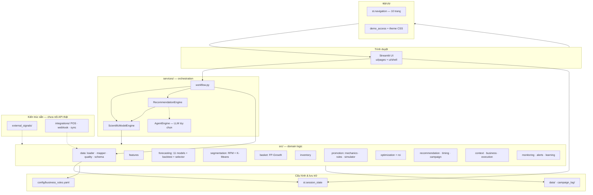
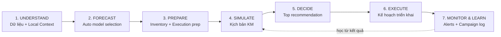
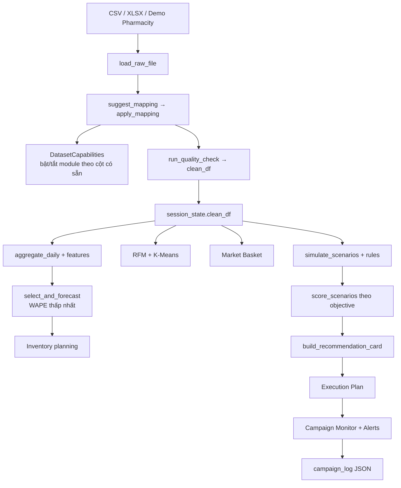

# PromotionPilot AI

**AI-Powered Local Demand & Marketing Decision Platform** — trước đây gọi là PromoPilot AI.

> "Local knowledge + Business data + AI = Better Marketing Decisions"

## 1. PromotionPilot AI là gì?

PromotionPilot AI là một website (chạy được local hoặc deploy lên cloud) giúp doanh nghiệp dùng
dữ liệu bán hàng sẵn có (Excel/CSV xuất từ POS) **và** hiểu biết địa phương (đối thủ, mùa vụ, đặc
điểm khách hàng khu vực...) để:

1. **UNDERSTAND** — Hiểu nhu cầu địa phương (Local Context + Data Quality).
2. **FORECAST** — Dự báo demand, traffic, doanh thu (Auto Model Selection).
3. **PREPARE** — Chuẩn bị tồn kho, nhân sự, ngân sách (Inventory Planning + Execution Plan).
4. **SIMULATE** — Mô phỏng nhiều kịch bản giá/khuyến mãi/thương hiệu (Promotion Simulator).
5. **DECIDE** — Chọn phương án tốt nhất, có Top 3 để so sánh (AI Recommendation).
6. **EXECUTE** — Tạo kế hoạch triển khai theo phòng ban + nội dung marketing (Execution Plan).
7. **MONITOR & LEARN** — Theo dõi Actual vs Forecast, cảnh báo, đề xuất Continue/Adjust/Stop/Scale
   (Campaign Monitor + Alerts + Campaign Learning Loop).

Toàn bộ hệ thống được thiết kế theo nguyên tắc:

```
CORE AI ENGINE + BUSINESS CONFIGURATION + COMPANY DATA + BUSINESS CONSTRAINTS
= COMPANY-SPECIFIC RECOMMENDATION
```

Nghĩa là **không có một mô hình/đề xuất cố định** áp dụng giống nhau cho mọi doanh nghiệp — mọi
kết quả đều phụ thuộc vào dữ liệu, bối cảnh địa phương, và mục tiêu của chính doanh nghiệp bạn.

## 2. Use case

**Use case chính (demo mẫu): chuỗi nhà thuốc kiểu Pharmacity.** Một cửa hàng có đối thủ mới mở gần
đó. Chủ cửa hàng nhập bối cảnh này vào **Local Context** → hệ thống gợi ý mục tiêu **TRAFFIC** →
dự báo nhu cầu/tồn kho → mô phỏng 3-5 kịch bản khuyến mãi → đề xuất phương án tốt nhất kèm Top 3 →
tạo Execution Plan → theo dõi Actual vs Forecast sau vài ngày chạy thật → nhận cảnh báo và đề xuất
Continue/Adjust/Stop/Scale.

**Use case SME:** doanh nghiệp vừa và nhỏ chỉ có Excel/CSV cơ bản (Ngày, SKU, Số lượng, Doanh thu),
không có Data Scientist. Hệ thống tự giảm phạm vi phân tích theo dữ liệu có sẵn, không crash khi
thiếu trường (Mã khách hàng, Tồn kho, Giá vốn...).

## 3. Cách chạy — Local (Python)

Cần **Python 3.10+** (đã kiểm thử với 3.14).

```bash
python -m venv .venv
```

Kích hoạt: Windows PowerShell `.venv\Scripts\Activate.ps1` · Windows cmd `.venv\Scripts\activate.bat`
· macOS/Linux `source .venv/bin/activate`

```bash
pip install --upgrade pip
pip install -r requirements.txt
python scripts/generate_pharmacity_demo.py   # sinh dữ liệu demo (1 lần)
streamlit run app.py
```

Trình duyệt tự mở tại `http://localhost:8501`. Ở trang **Tổng quan**, bấm **"Mở Data Workspace"**
→ **"Dùng dữ liệu mẫu"** để trải nghiệm ngay, hoặc **"Tải file mẫu"** để lấy file Excel cấu trúc
chuẩn rồi tự điền dữ liệu thật và upload lại.

**Windows không rành dòng lệnh:** dùng `CAI_DAT_LAN_DAU.bat` (chạy 1 lần) rồi `CHAY_UNG_DUNG.bat`
(chạy mỗi lần dùng) — xem [HUONG_DAN_CAI_DAT.txt](HUONG_DAN_CAI_DAT.txt).

## 4. Cách deploy lên Cloud (website demo, không cần cài Python)

### Streamlit Community Cloud (miễn phí, khuyến nghị)

1. Đẩy code lên GitHub (repo có thể public hoặc private).
2. Vào [share.streamlit.io](https://share.streamlit.io), đăng nhập bằng GitHub.
3. "New app" → chọn repo → Main file path: `app.py` → Deploy.
4. (Tuỳ chọn) Vào **Settings → Secrets**, thêm các biến trong `.env.example` nếu cần (vd
   `DEMO_ACCESS_CODE`, `OPENAI_API_KEY`) — Streamlit Cloud đọc secrets qua `st.secrets`, còn code
   hiện dùng `python-dotenv`/`os.getenv` nên với deploy cloud, thêm biến qua **Settings → Secrets**
   dạng `KEY = "value"` và chúng sẽ có sẵn trong `os.environ` tự động.
5. Sau vài phút, có link công khai dạng `https://<ten-app>.streamlit.app`.

Miễn phí, ~1GB RAM — bộ dữ liệu demo (`data/pharmacity_demo.csv`, ~360.000 dòng) đã được thiết kế
để chạy vừa trong giới hạn này (xem mục "Quyết định điều chỉnh dữ liệu demo" bên dưới).

### Render / Railway (thay thế)

Cả hai đều hỗ trợ deploy trực tiếp từ GitHub repo Python:
- Build command: `pip install -r requirements.txt`
- Start command: `streamlit run app.py --server.port $PORT --server.address 0.0.0.0`

## 5. Cấu trúc website & kiến trúc

### Navigation hiện tại (10 trang)

UI gộp theo workflow **7 bước quyết định** (thanh stage bar trong `ui/shell.py`), đăng ký qua
`st.navigation` trong `app.py`:

| Trang (`ui/pages/`) | Nhãn sidebar | Vai trò |
|---|---|---|
| `command_center` | Tổng quan | KPI, cơ hội, mở Data Workspace |
| `understand` | Hiểu thị trường | Dữ liệu, Local Context, mục tiêu, RFM/Basket |
| `forecast` | Dự báo | Auto Model Selection |
| `prepare` | Chuẩn bị | Tồn kho, ngân sách, chuẩn bị triển khai |
| `simulate` | Mô phỏng chiến dịch | Promotion Simulator — so sánh kịch bản |
| `decide` | Quyết định | Recommendation + Top phương án |
| `execute` | Triển khai | Execution Plan + nội dung marketing |
| `monitor` | Học hỏi và tối ưu | Campaign Monitor + Alerts + Learning Loop |
| `reports` | Báo cáo | Xuất Excel/CSV từ kết quả phiên |
| `model_info` | Thông tin thêm | Model & độ tin cậy |

Tải/map dữ liệu nằm trong **Data Workspace** (modal từ Tổng quan / Hiểu thị trường —
`ui/pages/data_workspace.py`), không còn là trang sidebar riêng.

Các trang Streamlit cũ (16 trang rời) được giữ ở `legacy_pages/` để tham chiếu; **không** còn là
điểm vào chính của app.

### Kiến trúc tổng quan (3 lớp)



- **`ui/`** chỉ render và gọi `services/`; không chứa công thức nghiệp vụ.
- **`services/workflow.py`** gắn UI với pipeline hiện có (load demo, forecast, simulate, decide…).
- **`services/scientific_model_engine.py`** bọc các hàm `src/` (forecast, RFM, inventory, simulate…).
- **`services/recommendation_engine.py`** dựng thẻ đề xuất; `AgentEngine` (LLM) chỉ enhance nội dung
  khi được bật — **không** quyết định khuyến mãi.
- **State dùng chung:** `src/utils/state.py` → `st.session_state` (`clean_df`, forecast cache,
  scenario, recommendation, execution plan…). Qua F5/reload, snapshot được ghi/nạp bởi
  `src/utils/session_persistence.py` (cookie + `?wid=` + file trong `config/session_workspace/`).
- **Chưa nối nguồn thật:** `src/external_signals/`, `src/integrations/` (xem mục 9–10).

### Luồng nghiệp vụ (7 bước)



### Pipeline dữ liệu → quyết định



## 6. Định dạng dữ liệu (Data Format)

Chấp nhận **CSV** hoặc **Excel (.xlsx/.xls, kể cả nhiều sheet)**. Không yêu cầu tên cột cụ thể —
**Data Mapping Wizard** tự gợi ý (hỗ trợ tên tiếng Việt có dấu VÀ tên tiếng Anh kiểu
`TransactionID`, `SKU_ID`, `Price_per_unit`...).

**Bắt buộc tối thiểu:** Ngày (Date), Mã sản phẩm (SKU_ID/Product_ID), Số lượng (Quantity),
Doanh thu (Revenue).

**Tuỳ chọn (càng nhiều càng mở thêm module):** TransactionID, CustomerID, Category, Store_ID,
Price_per_unit, COGS, Gross_Profit, Inventory_Onhand, PromotionID, Scheme_Promotion, Discount_Pct,
Start_Date_Promotion, End_Date_Promotion.

Hệ thống **không crash** nếu thiếu trường tuỳ chọn — module liên quan tự tắt, giải thích rõ lý do
(vd thiếu CustomerID → không chạy RFM; thiếu Inventory_Onhand → không tính stock recommendation).

**File mẫu có sẵn:**
- `data/pharmacity_demo.csv` — bộ demo lớn (~360.000 dòng, 6 tháng, 43 SKU, ~106.000 giao dịch,
  30% thiếu CustomerID) dùng cho nút **"Dùng dữ liệu mẫu"** trong Data Workspace.
- `data/mau_du_lieu_promotionpilot.xlsx` — file mẫu XLSX nhỏ có 3 sheet (Sales_Data,
  Promotion_Master, Business_Config) để tải về, tự điền dữ liệu thật, upload lại.

> **Quyết định điều chỉnh dữ liệu demo:** spec gốc yêu cầu 24 tháng x ~500 giao dịch/ngày
> (~1.2 triệu dòng). Con số này vượt xa mức hiệu năng mục tiêu (~vài trăm nghìn giao dịch) và có
> thể làm chậm/timeout trên hạ tầng free-tier khi demo trực tiếp. Đã giảm còn 6 tháng
> (~360.000 dòng) — vẫn đủ dài để forecast nhận diện seasonality theo tuần/tháng, đã kiểm thử chạy
> mượt trên máy dev thông thường. Xem `docs/nhat_ky_nang_cap.md`.

## 7. Các mô hình được sử dụng

**Dự báo (Auto Model Selection):** Naive, Seasonal Naive, Moving Average, Exponential Smoothing,
Holt-Winters, Random Forest, Gradient Boosting, XGBoost, LightGBM, CatBoost, Ensemble
(Holt-Winters + Random Forest) — 11 model, tự backtest (rolling-origin time-series split), chọn
theo WAPE thấp nhất. Model boosting tự bỏ qua nếu chưa cài thư viện — không crash.

**Khách hàng:** RFM + K-Means (tự chọn số cụm qua silhouette score, tối thiểu 30 khách hàng).

**Giỏ hàng:** FP-Growth + Association Rules (`mlxtend`).

**Khuyến mãi:** Hybrid Rule-based Engine (business rules + objective function + constraints) +
giả định elasticity theo cơ chế (gắn nhãn `[ASSUMPTION]` rõ ràng) + uplift từ lịch sử thật nếu có
đủ dữ liệu. **LLM không được dùng để quyết định khuyến mãi** — chỉ sinh nội dung marketing.

**Alert / AI Action (Continue/Adjust/Stop/Scale):** rule engine thuần tuý (mục XXX-XXXI), dựa trên
số liệu Actual vs Forecast — không dùng LLM.

## 8. Input tối thiểu vs. Input tốt nhất

| | Input tối thiểu | Input tốt nhất |
|---|---|---|
| Bắt buộc có | Date, SKU_ID, Quantity, Revenue | + TransactionID, CustomerID, COGS, Inventory_Onhand, lịch sử khuyến mãi |
| Modules hoạt động | Dự báo cơ bản, Xếp hạng sản phẩm | Toàn bộ: RFM, Basket, Inventory, Historical uplift, Local Context, Monitor/Alerts |
| Độ tin cậy | Thấp–Trung bình (đặc biệt nếu <14 ngày dữ liệu) | Cao hơn với ≥6 tháng dữ liệu |

## 9. Modules đang mock vs. modules chạy model thật

**Chạy model/logic thật (không mock):** Data loader/mapper/quality, Forecast (11 model thật, có
backtest thật), Inventory Planning, RFM + K-Means, Market Basket (FP-Growth thật), Promotion
Simulator (tính GP/ROI thật theo công thức tài chính), Business Rules Engine, Recommendation
Engine (Top 3 thật, phụ thuộc dữ liệu), Execution Plan generator, Campaign Monitor (so sánh
Actual/Forecast thật), Alert Engine + AI Action (rule-based thật), Campaign Learning Loop (lưu trữ
JSON thật).

**Kiến trúc sẵn sàng nhưng CHƯA kết nối nguồn thật (không fake data, hiển thị rõ "chưa kết nối"):**
`src/external_signals/` (Social Listening, Weather, Competitor Price, Google Trends, Local Events),
`src/integrations/` (POS API, Webhook, Event Stream, Inventory Sync, Customer Sync).

## 10. Realtime / POS Integration Roadmap

- **Level 1 (hiện tại):** Upload Excel/CSV thủ công.
- **Level 2:** POS API polling định kỳ (`src/integrations/pos_api.py`, `inventory_sync.py`,
  `customer_sync.py` — đã có interface, chưa kết nối thật).
- **Level 3:** Webhook — POS đẩy sự kiện bán hàng theo thời gian thực
  (`src/integrations/webhook.py`).
- **Level 4:** Enterprise Event Bus (Kafka/RabbitMQ...) cho hệ thống nhiều cửa hàng/nhiều nguồn
  (`src/integrations/event_stream.py`).

## 11. Limitations (Giới hạn của MVP)

- **Không phải causal inference thật**: uplift khuyến mãi dựa trên giả định elasticity hoặc so
  sánh lịch sử đơn giản (pre/post theo weekday), KHÔNG kiểm soát confounder.
- **Chưa có cơ chế theo dõi độ chính xác dự báo theo thời gian** (accuracy tracking dashboard) —
  ưu tiên hàng đầu trong `docs/backlog_tinh_nang.md`.
- **Chưa có Contextual Bandit / Reinforcement Learning** để tối ưu khuyến mãi theo thời gian thực.
- **External Signals / Integrations là kiến trúc, chưa kết nối API thật** (xem mục 9-10).
- **Baseline dự báo theo ngày trong Campaign Monitor là chia đều (uniform)** — chưa có forecast
  dạng phân phối theo từng ngày cho scenario khuyến mãi cụ thể.
- **Chưa có hierarchical forecasting reconciliation** chính thức (MinT...) giữa cấp SKU/Category/Company.
- **Xuất PDF report chưa triển khai** — chỉ có Excel/CSV.
- **Market Basket Analysis có thể chậm** (30-50s) trên dataset >100.000 giao dịch — xem backlog để
  biết hướng tối ưu.
- **Dữ liệu quá ít (<14 ngày)** chỉ dùng model Naive, cảnh báo độ tin cậy Thấp.

## 12. Cách Pilot cho doanh nghiệp

Xem chi tiết quy trình 5 ngày tại [`docs/huong_dan_pilot.md`](docs/huong_dan_pilot.md).

## 13. Data Privacy

- Ứng dụng có thể chạy **local** (không gửi dữ liệu ra ngoài) hoặc deploy cloud để chia sẻ link —
  bạn tự quyết định theo nhu cầu triển khai thực tế.
- LLM (tuỳ chọn, mặc định **tắt**) chỉ nhận **số liệu tổng hợp** (aggregated summary) để sinh nội
  dung marketing — **không bao giờ** nhận dữ liệu giao dịch chi tiết (transaction-level).
- **Ẩn/mã hoá Mã khách hàng**: bật ở trang **Hiểu thị trường** ("Ẩn/mã hoá Mã khách hàng khi
  hiển thị bảng chi tiết & xuất báo cáo") — hash SHA-256 khi hiển thị/export, không đổi dữ liệu
  gốc dùng để tính toán (`src/utils/privacy.py`).
- Không hard-code API key; cấu hình qua `.env` / Streamlit Secrets (xem `.env.example`).
- Có thể bật **Demo Access Code** (`DEMO_ACCESS_CODE` trong `.env`) để hạn chế truy cập ngẫu nhiên
  khi deploy bản demo công khai.

## Cấu trúc thư mục

```
promotionpilot-ai/
  app.py                         # Điểm khởi chạy — st.navigation (10 trang)
  ui/
    shell.py · nav.py            # Khung app, sidebar, thanh 7 bước
    pages/                       # command_center, understand, forecast, prepare,
                                 # simulate, decide, execute, monitor, reports, model_info
                                 # + data_workspace (modal tải/map dữ liệu)
    charts.py · components.py · formatters.py · icons.py
  services/
    workflow.py                  # Điều phối UI ↔ src (load, forecast, simulate, decide...)
    scientific_model_engine.py   # Bọc model/logic khoa học trong src/
    recommendation_engine.py     # Recommendation (+ AgentEngine LLM tùy chọn)
    agent_engine.py              # LLM enhance nội dung — không quyết định KM
  src/
    data/                        # loader (đa sheet), mapper, quality, schema
    features/                    # feature engineering cho time series
    forecasting/                 # 11 model, backtest, auto model selection
    segmentation/                # RFM, K-Means
    basket/                      # market basket analysis (FP-Growth)
    inventory/                   # inventory planning
    promotion/                   # mechanics, business rules, simulator
    optimization/                # objective functions (5 mục tiêu, có BRANDING)
    roi/                         # ROI calculator
    recommendation/              # recommendation engine, timing, campaign generator
    explainability/              # giải thích bằng ngôn ngữ kinh doanh
    business/                    # business profile onboarding
    context/                     # Local Context (business/customer/store context)
    execution/                   # Execution Plan generator (D-7..D+7)
    monitoring/                  # Campaign Monitor (Actual vs Forecast)
    alerts/                      # Alert Engine + AI Action (Continue/Adjust/Stop/Scale)
    learning/                    # Campaign Learning Loop (lưu lịch sử campaign)
    external_signals/            # Kiến trúc sẵn sàng: weather, competitor, trends... (chưa kết nối)
    integrations/                # Kiến trúc sẵn sàng: POS API, webhook... (chưa kết nối)
    utils/                       # session state, privacy, demo_access, heavy_jobs
  styles/theme.py                # CSS / theme Streamlit
  legacy_pages/                  # Các trang Streamlit cũ (16 trang) — không còn entry chính
  config/
    business_rules.yaml          # Cấu hình mặc định (margin, ROI, lead time...)
    business_profiles/           # Hồ sơ doanh nghiệp đã lưu (tự tạo khi chạy)
    campaign_log/                # Campaign Learning Loop (tự tạo khi chạy)
  data/                          # pharmacity_demo.csv, mau_du_lieu_promotionpilot.xlsx
  scripts/                       # generate_pharmacity_demo.py, smoke_test_pipeline.py, ...
  tests/                         # pytest (~64 test)
  docs/                          # nghien_cuu_nen_tang.md, huong_dan_pilot.md, backlog, nhật ký
  .claude/skills/nang-cap-promopilot/  # Skill tự nâng cấp có hệ thống
```

## Chạy test

```bash
pytest
```

## Business Disclaimer

> Recommendation của hệ thống là công cụ hỗ trợ quyết định, không thay thế quyết định kinh doanh
> cuối cùng của doanh nghiệp.

## Giấy phép / Liên hệ

Dự án MVP nội bộ — vui lòng liên hệ nhóm phát triển để biết thêm chi tiết triển khai thực tế.
